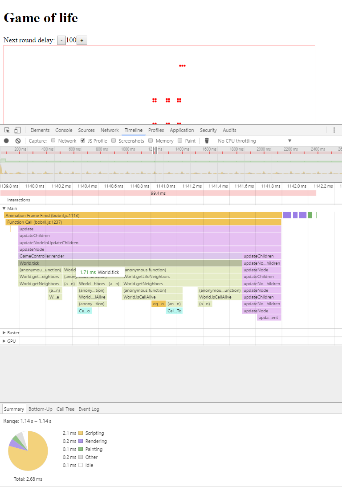
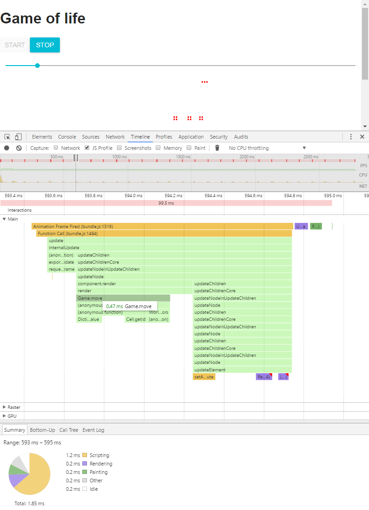

Game of life 2.0
================

As part of my lecturing on GMC Academy I rewrote my old game of life example.

New implementation was done as TDD outside-in (see commits for details).

For compilation use [bobril-build](https://github.com/Bobris/bobril-build)

I have plan to create classes:
* Game - The game rules are the responsibility of the class.
* World – Cell management.
* Cell

First, I create a class game with mock implementation of world. 
After that I implement world with cell mock.
As last part of new algorithm cell class was implemented.

I also added support for mouse click and move on canvas. So you can add cells by click or hold down left mouse button and move.

Game of life 2.0 algorithm without mouse support have approximately 30% more line of codes that version 1.0. Thanks to more optimal data structure and reduction of repetitive iteration over all cells new algorithm is faster. You can see it on timeline:





